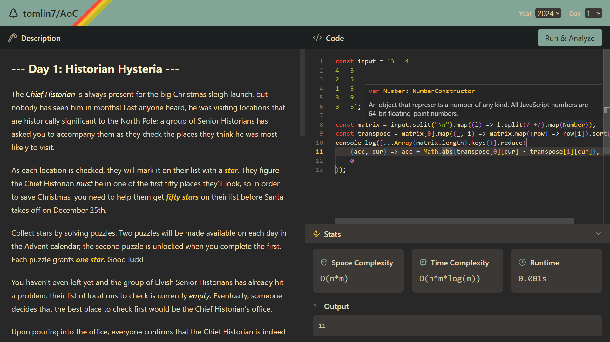

# Advent of Code

Home repo for my solutions and an editor and bench tool for supercharging Advent of Code! 



Also includes a notification daemon for daily AoC challenge notifications during Dece 1-25!


## Getting Started

You will need bun/npm:

```bash
bun i
bun run dev
```

thats it! You can now visit `localhost:5173` to see the app.
